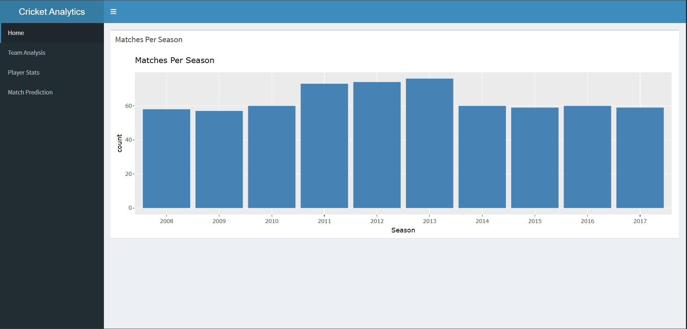
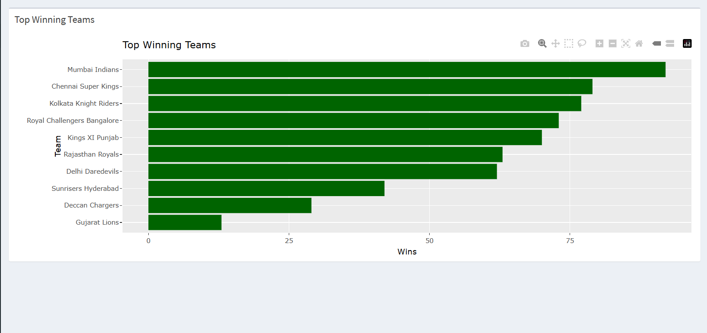
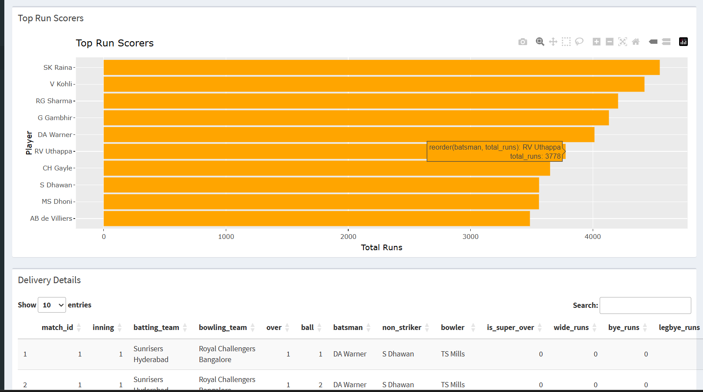
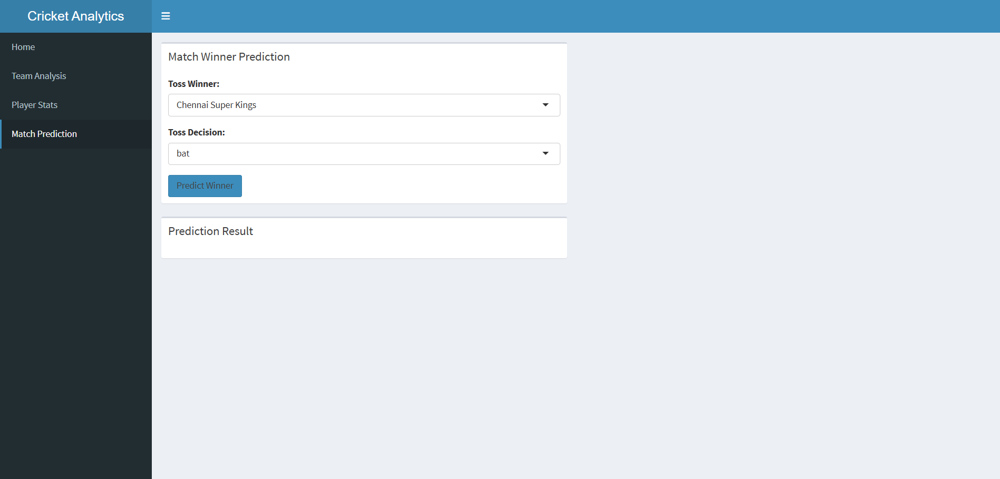

# 🏏 Cricket Match Analytics Dashboard

A Data Science project built using **R**, **Machine Learning**, and **Data Visualization** to analyze IPL cricket match data.

---

# 📌 Project Overview

This project analyzes IPL cricket match datasets and provides:

- Match analysis
- Team performance insights
- Top run scorers
- Match predictions using Machine Learning
- Data visualizations

The project is built completely in **R** using:
- tidyverse
- ggplot2
- randomForest

---

# 🚀 Features

✅ Matches per season analysis  
✅ Top winning teams visualization  
✅ Top run scorers analysis  
✅ Match winner prediction model  
✅ Cleaned and processed IPL dataset  
✅ Data visualization using ggplot2  

---

# 🛠️ Technologies Used

| Technology | Purpose |
|---|---|
| R | Programming Language |
| tidyverse | Data Cleaning |
| ggplot2 | Data Visualization |
| randomForest | Machine Learning |
| vscode | Development Environment |

---

# 📂 Project Structure

```bash
CRICKET-MATCH-ANALYTICS/
│
├── data/
│   ├── matches.csv
│   ├── deliveries.csv
│   ├── cleaned_matches.csv
│   └── cleaned_deliveries.csv
│
├── scripts/
│   ├── load_data.R
│   ├── data_cleaning.R
│   ├── EDA.R
│   └── interactive_charts.R
│
├── model/
│   ├── train_model.R
│   └── win_predictor.rds
│
├── images/
│   ├── matches_per_season.png
│   ├── top_winning_teams.png
│   ├── top_run_scores.png
│   └── prediction.png
│
└── README.md
```

---

# 📊 Visualizations

## Matches Per Season



---

## Top Winning Teams



---

## Top Run Scorers



---

## Match Prediction



---

# 🤖 Machine Learning Model

The project uses a **Random Forest Classifier** to predict match winners based on:

- Toss winner
- Toss decision

---

# 📈 Sample Accuracy

```text
Accuracy: 0.62
```

---

# ▶️ How to Run

## 1 Clone Repository

```bash
git clone YOUR_GITHUB_REPO_LINK
```

## 2 Open Project in RStudio

Open the project folder.

## 3 Install Packages

```r
install.packages(c(
  "tidyverse",
  "ggplot2",
  "randomForest"
))
```

## 4 Run Scripts

Run files in this order:

```text
load_data.R
data_cleaning.R
eda.R
train_model.R
```

---

